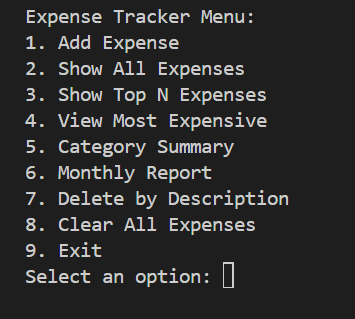
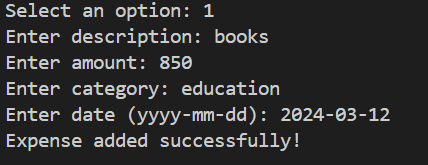

# Expense Tracker (Java CLI)

A simple command-line based Expense Tracker built in Java. It allows you to record, view, and analyze your personal expenses without needing a database. Everything runs in memory with clean OOP design and modular structure.

---

## ✨ Features

- Add expenses with description, amount, category, and date
- View all recorded expenses
- Display top N most expensive items
- Get category-wise spending summary
- View monthly expense report
- Delete expenses by description
- Clear all data with confirmation
- Simple and interactive menu-based UI

---

